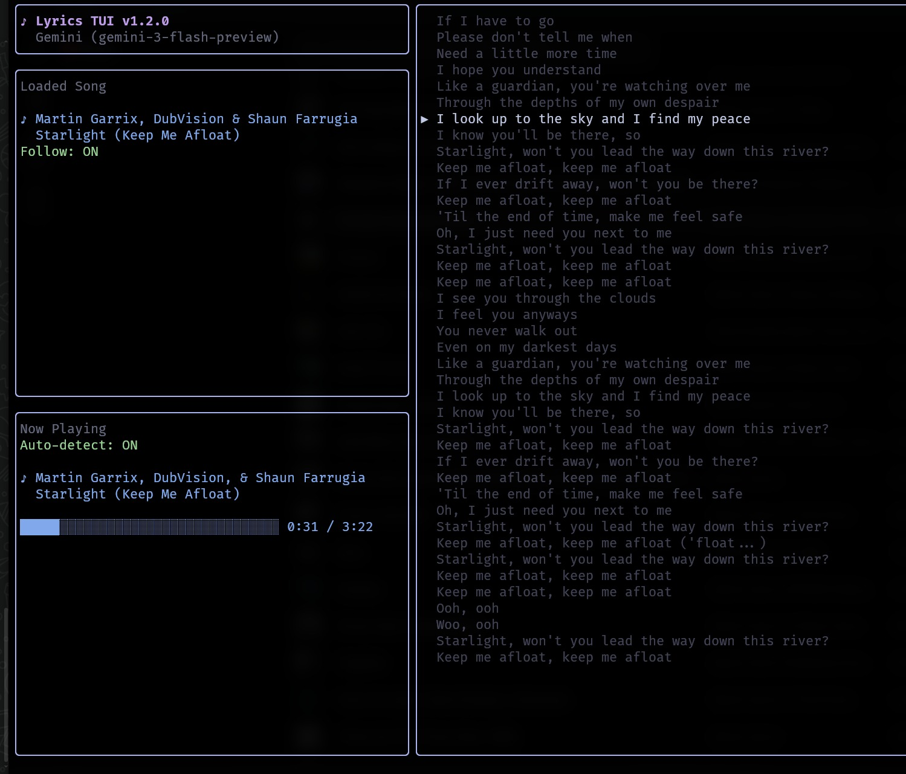
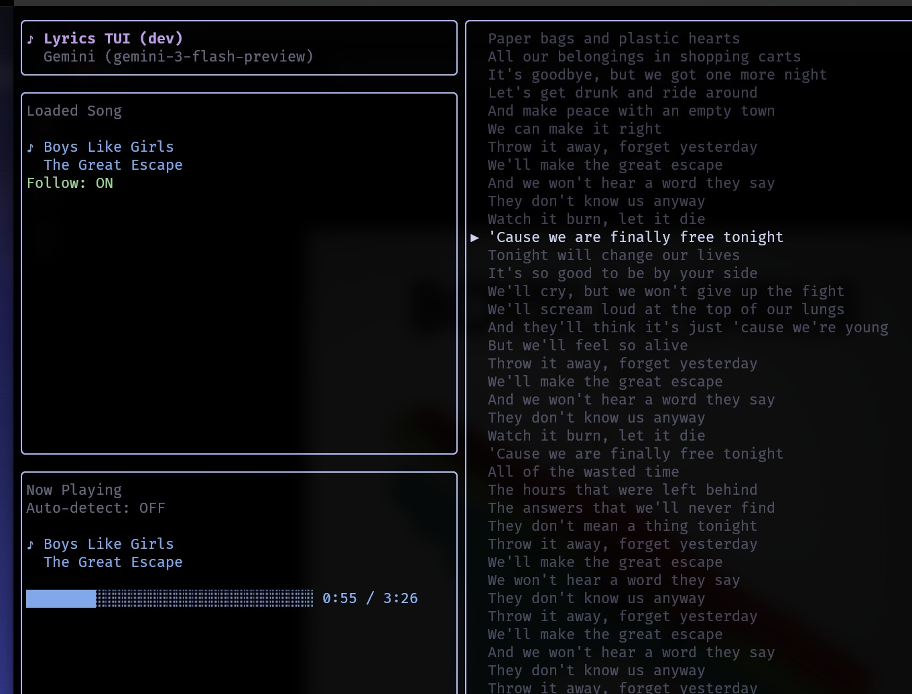
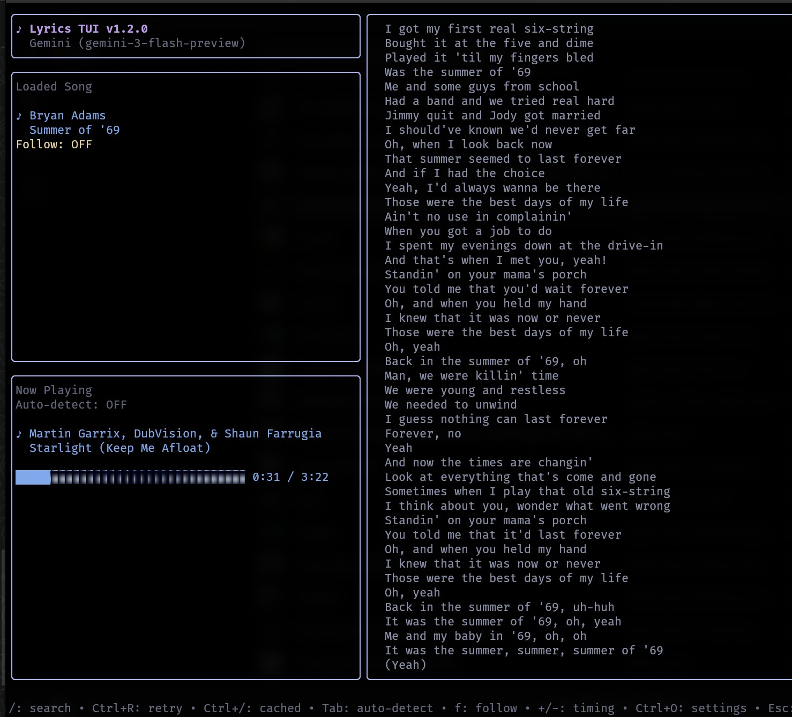
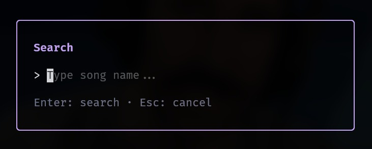
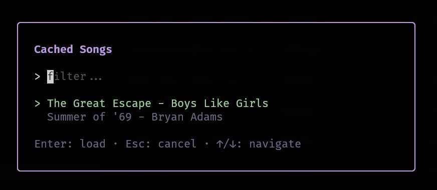
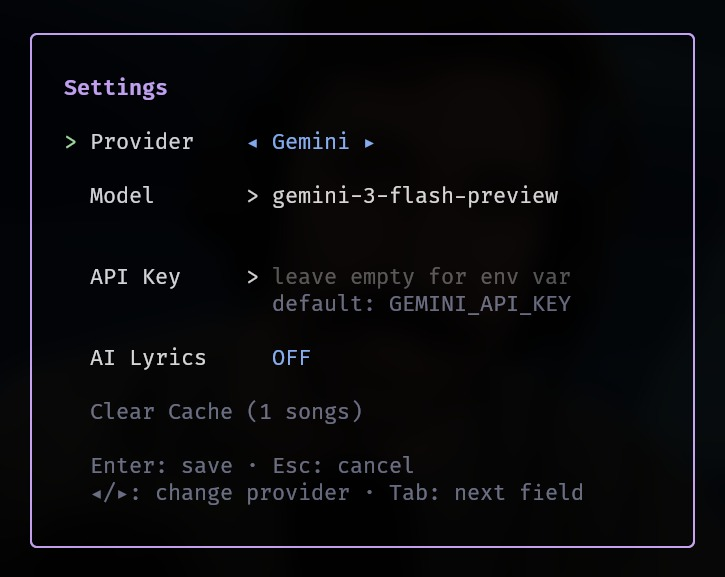

# Lyrics TUI

[](https://github.com/osszoi/lyrics-tui/releases/latest)

<p align="center">
  
</p>

A terminal-based lyrics viewer with automatic song detection and synchronized lyric highlighting.

## Prerequisites

- Go 1.18 or higher
- Linux with D-Bus and MPRIS support
- Claude CLI tool installed and configured
- Genius API access token

## Installation

### Install via Go (recommended)

```bash
go install github.com/osszoi/lyrics-tui@latest
```

Make sure `$HOME/go/bin` is in your PATH.

### Download binary

Download the latest release from the [releases page](https://github.com/osszoi/lyrics-tui/releases) and extract it.

### Build from source

```bash
git clone https://github.com/osszoi/lyrics-tui.git
cd lyrics-tui
go build
```

## Configuration

The application works without configuration, but you can optionally set up a Genius API token for fallback lyrics when synced lyrics are unavailable.

Create a `.env` file:
```bash
GENIUS_ACCESS_TOKEN=your_genius_api_token_here
```

Get a token at https://genius.com/api-clients

## Screenshots

| | |
|---|---|
| **Auto detect on, follow on** | **Follow on, detect off** |
|  |  |
| **Follow off, playing other song** | **Search box** |
|  |  |
| **Cached songs modal** | **Settings modal** |
|  |  |

## License

MIT
